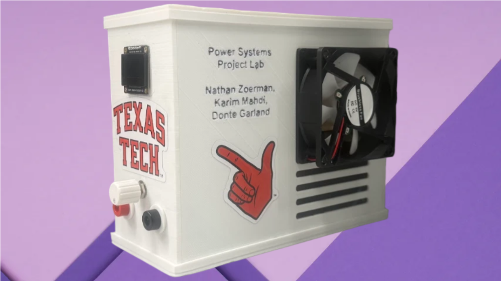

<div align="center">

# DC Protection Unit Enclosure

**The printed housing for a DC load protection unit rated 40 V in and 5 A
continuous: what it had to do, what the surviving renders and photographs show,
and what the built unit did differently from the model.**

[](LICENSE)
[](docs/GUIDE.md)
[](https://github.com/karimrayttu/dc-protection-unit-40v)
[](CONTRIBUTING.md)

[What it is](#at-a-glance) · [The built unit](#the-built-unit) ·
[Model against build](#the-model-and-the-built-unit-differ) ·
[Guide](docs/GUIDE.md) · [Contributing](CONTRIBUTING.md)

</div>



That title image is a composite: the unit has been cut out and dropped onto a
flat backdrop. The two bench photographs in the guide are unedited frames.

---

## At a glance

| | |
|---|---|
| **What this is** | The box. The circuit, the firmware and every electrical measurement live in [dc-protection-unit-40v](https://github.com/karimrayttu/dc-protection-unit-40v). |
| **Operator face** | Everything a person touches is on one narrow end face: a 0.96 inch 128x64 OLED high up, the potentiometer shaft and the red and black banana terminals low down. |
| **Cooling** | A fan and vent openings, all on one large face. |
| **What survives** | The design intent, a print-settings note written at the time, two renders and three photographs. |
| **What does not** | The CAD source and the exported meshes. Nothing on any drive still holds them. |

> **There is no CAD source and no STL here.** The model and the exported meshes
> are gone. If the files ever turn up, the source model belongs in `cad/` and the
> meshes in `stl/`.

---

## The built unit

**The human-facing layout worked out as planned.** Grouping the display, the
adjustment knob and both terminals on one end face means the unit has a front:
it can be set on a bench against a wall, or slid into a rack, without any of the
interface being buried. All of the cooling sits on the opposite large face, so
nothing an operator reaches for is next to moving air.

**The cooling that was built is not the cooling that was designed.** The
surviving render puts nine angled louvres in the wall *opposite* the fan, so air
would cross the box. All three photographs of the finished unit show four
straight slots in the *same* wall as the fan, directly below it. The
air-crosses-the-board argument is what the render supports; the photographs show
a different build.

**The thermal case the material was chosen against.** The argument was made from
2.5 W dissipated in a 0.1 ohm shunt at 5 A. The hardware photographed in the
Power Systems project uses a 1 ohm 5 W wirewound resistor instead, which at 5 A
would dissipate 25 W, ten times the design case and five times that part's own
rating. That mismatch belongs to the electronics repository, but it is the reason
the enclosure's thermal argument is stated as a design case rather than as a
measurement: no temperature inside this box was recorded at any current.

---

## The model and the built unit differ

The guide sets out, side by side, the geometry the two renders fix and the
geometry they leave open, and every point where the photographs disagree with
the model. Reprinting the enclosure means modelling it again from the renders,
and the guide is written so that is possible: it says which dimensions are
recoverable, which are not, and what the print settings were.

| | |
|---|---|
|  |  |
| The closed body, second revision. The narrow end face carries the display window high up and, low down, two round terminal openings and one small shaft opening; the large face carries the name block and the square fan aperture. | The same body with the top cover and the large front face hidden: a bare floor, nine louvre slots in the far wall, and a stepped lap profile down the vertical edge. Counting those nine slots is what the render-against-photograph comparison rests on. |

---

## Checking this repository

Two commands confirm the documents and the images agree with each other. Both
run from the repository root with any Python 3:

```
python -c "import re,pathlib;bad=[f'{p}: {l}' for p in pathlib.Path('.').rglob('*.md') for l in re.findall(r'!\[[^]]*\]\(([^)]+)\)',p.read_text(encoding='utf-8')) if not (p.parent/l).exists()];print(bad or 'every image link resolves')"
```

```
python -c "import pathlib;prose=''.join(p.read_text(encoding='utf-8') for p in pathlib.Path('.').rglob('*.md'));print([f.name for f in pathlib.Path('docs').iterdir() if f.suffix.lower() in ('.png','.jpg') and f.name not in prose] or 'every image is referenced')"
```

---

## Layout

```
README.md                      this file
LICENSE                        MIT
docs/
  GUIDE.md                     design and test report
  unit.png                     studio composite of the finished unit
  cad_closed.png               render, second revision, body closed
  cad_open.png                 render, same body, top and one large face hidden
  enclosure_assembled_1.jpg    bench photograph, end face and display
  enclosure_assembled_2.jpg    bench photograph, whole unit from further back
```

---

## Documentation

**[docs/GUIDE.md](docs/GUIDE.md)** covers the requirements, the geometry the
renders fix, the differences between the model and the built unit, the print
settings, the thermal argument, and how to re-derive every number here.

## Contributing

Pull requests are welcome. [CONTRIBUTING.md](CONTRIBUTING.md) lists the checks to
run before opening one.

## License

MIT. See [LICENSE](LICENSE).
