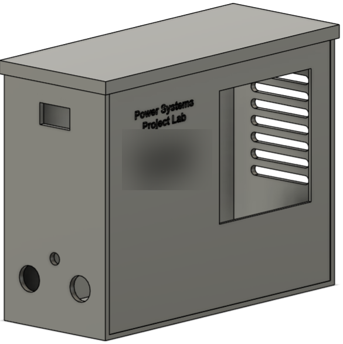
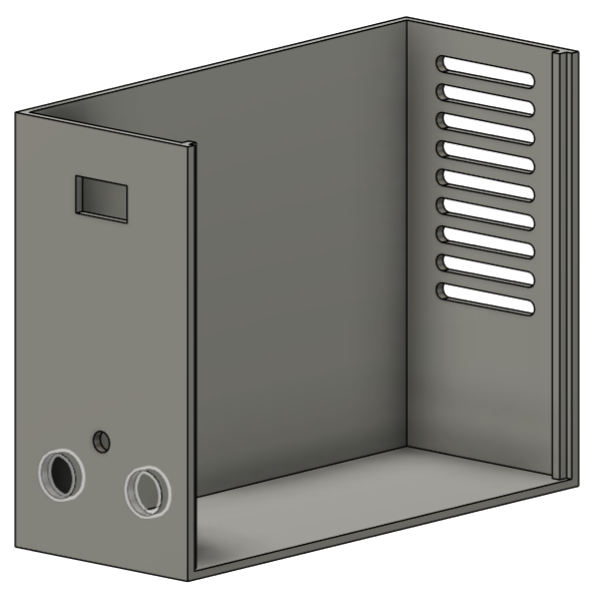
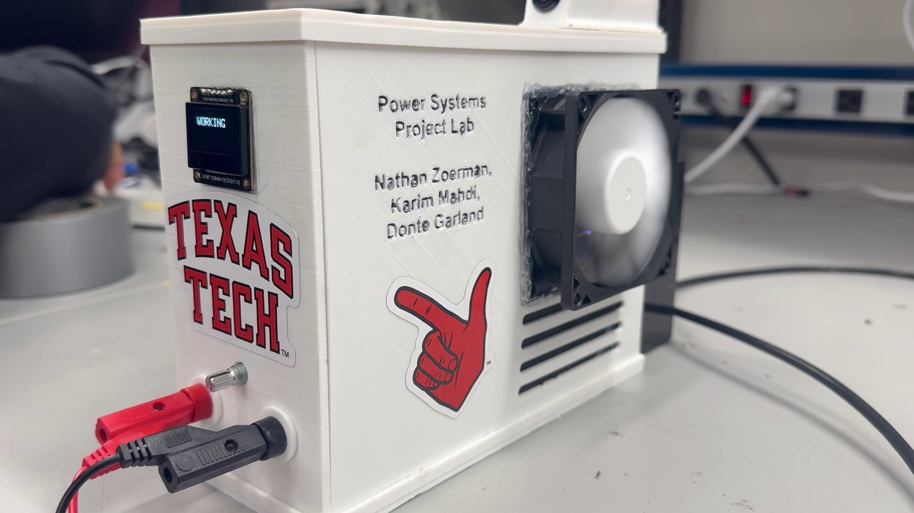
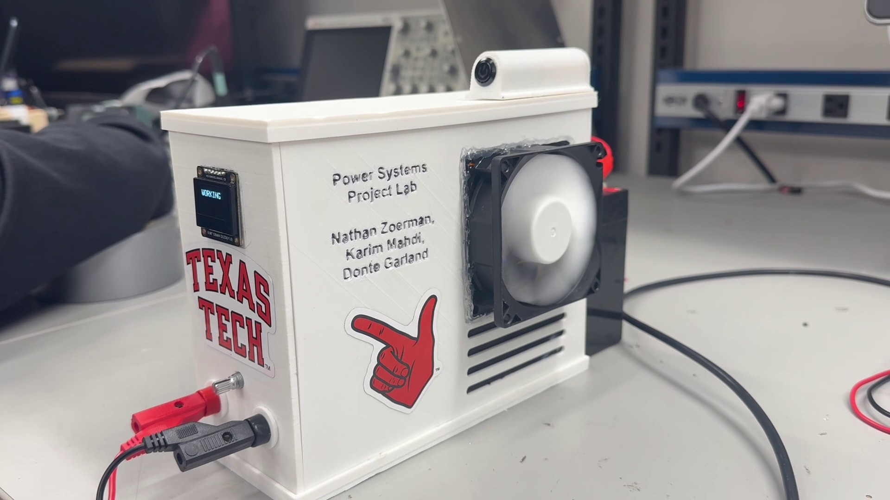

# The printed enclosure: design and test report

## The job

A DC load protection unit sits between a bench supply and a load. It carries up
to 40 V and 5 A continuous, and it opens the load when the input goes reverse,
over-voltage or over-current. Bare, it is a board with an exposed shunt, a pass
MOSFET, two comparators, a display module and a potentiometer, all of it live at
40 V. The enclosure had to turn that into something a person can pick up, read
and connect to without thinking about it.

Five things drove the shape:

- keep fingers away from the 40 V rail and the exposed shunt
- put the display where it can be read without lifting the unit
- put the DC terminals on the same face as the display, so one hand can work
- move air across the shunt and the pass MOSFET
- leave enough internal volume that the wiring is not a bird's nest

Nothing beyond that was written down as a requirement. There was no ingress
rating, no drop case, no target internal temperature, and no airflow figure. The
consequences of that last omission run through the rest of this report.

## What survives

| File | What it is |
| --- | --- |
| `cad_closed.png` | Render of the closed body, second revision |
| `cad_open.png` | Render of the same body with the top and one large face hidden |
| `unit.png` | Studio composite of the finished unit, cut out onto a flat backdrop |
| `enclosure_assembled_1.jpg` | Bench photograph, end face and display, unedited |
| `enclosure_assembled_2.jpg` | Bench photograph, whole unit, unedited |

The CAD source and the exported meshes are gone. No slicer project, no G-code, no
dimensioned drawing and no revision-one render survive either. Everything below
is read off those five images or is flagged as a recorded note that cannot be
checked against anything.

## The model, as designed

| Closed | Open |
| --- | --- |
|  |  |

**Figure 1 (left).** The closed body. The narrow end face carries the display
window high up and, low down, three openings: two round ones sized for the DC
terminals and one small one for a shaft. The large face carries the name block
and, at the far end, a square aperture with a recessed frame around it. Looking
through that aperture you see the vent louvres, which are cut in the opposite
wall. Six of them are fully visible through the opening and part of a seventh.
The name block is blurred in this render only.

**Figure 2 (right).** The same body with the top cover and the large face
removed, which is why this is not simply the lid lifted off. Three things are
worth reading from it. The wall thickness is constant, including around the
openings. The far wall carries nine louvres in total. And **the floor is a flat,
featureless plate**: no bosses, no posts, no standoffs, nothing to screw a board
to. How the PCB was actually held down is not recorded by anything here.

One more feature shows up in Figure 2 and nowhere else: a stepped lap profile
running the full height of the vertical edge at the far end of the body. It is
the only joint feature modelled anywhere in the box. What mates with it, the
cover or a separate end panel, is not something the render settles.

## The unit, as built

**Figure 3.** The unit on the bench, leads in, fan turning. The display module is
a 0.96 inch 128x64 OLED; its silkscreen reads `0.96" 128x64 OLED(V1.0)` and its
six-pin header is labelled `VCC GND SCL SDA DC CS`. The module sits proud of the
end face over its opening, with a translucent bead along one edge holding it
there; the four corner mounting holes in the module are empty. The screen reads
`WORKING`, one word, nothing else. That string does not exist in the published
firmware for this unit, whose status words are `NORMAL`, `OV FAULT`, `OC FAULT`,
`REVERSE` and `MULTI FAULT`. Whatever was flashed the day this frame was taken is
not in either repository, so the screen cannot be tied to a firmware state.

**Figure 4.** The same unit from further back, and the view that shows what the
renders turned into. The top cover is a flat plate overhanging the body on all
sides, with a rounded pod printed on top of it carrying a push button that faces
sideways. Neither the pod nor the button appears in either render. The fan is
bolted to the outside of the large face rather than let into the recess the
render shows, and a crumpled clear film is packed around its frame to close the
gap. Four straight slots sit directly below it, in the same wall.

The title image in the README is the third view of the same unit. It is a
composite, so it settles nothing about the bench setup, but it is the only image
that shows the terminal cluster unobstructed: a white potentiometer knob with its
hex nut, a red banana jack below it and a black one to the right.

## Where the model and the unit disagree

| | Second-revision render | Unit in the photographs |
| --- | --- | --- |
| Vent slots | nine angled louvres in the wall **opposite** the fan | four straight slots in the **same** wall, directly below the fan |
| Fan mounting | square aperture with a recessed frame | fan bolted to the outer surface, clear film packed round the frame |
| Display | plain rectangular window | module mounted over the opening, corner holes empty, bonded at one edge |
| Top cover | flat overhanging plate, nothing on it | same plate plus a printed pod carrying a push button |
| Name block | blurred | legible |

Whether the opposite-wall louvres were printed as well cannot be told: that wall
is never shown in any photograph. What is visible is that the built unit vents
next to its fan rather than across from it, which is a short circuit for the
airflow, not a path across the board.

Fan direction is worse than unresolved. The two sessions caught the fan fitted
opposite ways round. In the title image the strut side, the hub label and the
wire pigtail face outward, which on an axial fan is the exhaust side: air would
be pulled out of the box. In both bench photographs the smooth intake face is
outward and the blades are motion-blurred, so air is being pushed in. The fan was
unbolted and turned around at some point between the two sessions. No airflow
direction is claimed here, because the images contradict each other. The hub
label reads `Brushless Fan` with agency marks and no legible part number, so it
does not fix the size either.

## Print settings

Recorded at the time of printing. No slicer project survives, so this is a note,
not a file anyone can re-slice.

| Setting | Value |
| --- | --- |
| Material | PLA, or PETG near the fan and the power devices |
| Layer height | 0.20 mm |
| Infill | 20 to 40% |
| Perimeters | 3 or more |
| Supports | only under the end-face openings |
| Orientation | body flat on its base |

The orientation follows from the openings. Printed flat on its base, every hole
in the end face is a vertical wall feature, and only the round terminal openings
and the display window need support. The louvres in Figure 2 are angled, which is
what lets a slot that wide bridge without sagging.

## The thermal argument, and the hole in it

The case for PETG over PLA was made from one number. The design used a 0.1 ohm
current shunt, and at the rated 5 A that shunt burns

    0.1 x 5^2 = 2.5 W

inside a closed box, next to a pass MOSFET that is also dissipating. PLA's glass
transition sits near 60 C, which is not a comfortable margin over a small sealed
volume with a few watts in it; PETG holds shape to a higher temperature. That is
the whole of the argument. It is a materials judgement, not a calculation of what
the inside of this box actually reaches.

Two things undercut it.

The first is that nothing was instrumented. No temperature was ever recorded
inside the enclosure at any current, with or without the fan. The only thermal
capture anywhere in the project is in the Power Systems repository, an infrared
frame of a bench setup with a spot reading of 18.8 C against a 17.0 to 26.5 C
scale, taken at low current, on a board outside any box. It says nothing about
the shunt or the MOSFET at rated current and nothing at all about this enclosure.

The second is that the hardware in the photographs is not the hardware the
cooling was sized for. The Power Systems project records that the sense element
actually fitted was a white ceramic wirewound resistor marked `5W 1R J`: 1 ohm,
5 W. At 5 A that part would dissipate

    1 x 5^2 = 25 W

which is ten times the design case and five times what the part itself is rated
to survive. The photographed unit was therefore a low-current bench setup, and
the thermal case this box was ventilated for was never built, let alone measured.

So the cooling design is an intention. The fan aperture, the slots and the
material note are all consistent with someone thinking about heat. None of them
is evidence that heat was handled.

## Verification

What can be checked here is narrow, and worth stating precisely.

Two commands, given in the README, check that every image referenced by either
document resolves from the file it sits in, and that no image in `docs/` goes
unreferenced. Alongside them, the repository-set checker that covers this project
runs a publication sweep for absolute paths, instrument serials, network
addresses, university and course identifiers and credentials over every text
file, and a prose sweep over every Markdown file.

That set proves the documents point at files that exist, that no image is
undocumented, and that nothing in the text leaks what should not ship. Every
count and reading in this report was taken off the pixels: the louvres and the
slots were counted image by image, the silkscreen and the fan label were read at
magnification, and the two arithmetic results are one multiplication each.

It proves nothing about the object. There is no geometry to check, so no
dimension, wall thickness, clearance or fit can be verified, and no mesh can be
loaded to confirm the box is printable at all. Nothing in the checks touches
airflow, temperature or fastening.

## What is unproven

- **Outside dimensions.** The recorded design figure was 200 mm wide, 156 mm tall and
  80 mm deep. With the model gone there is no dimensioned drawing, and no
  photograph contains a scale reference. The images confirm only that the box is
  wider than it is tall and shallower than either.
- **Fan size.** The design called for an 80 mm fan. Nothing in the images fixes
  the scale, and the fan's label carries no readable part number.
- **Revision one.** The display window was resized to the measured module and the
  vents were added between revision one and revision two. No revision-one render,
  changelog or dimension note survives, so that history has to be taken on trust.
- **PCB mounting.** The only interior view shows a bare floor. No standoffs are
  modelled, and no fastener is visible in any photograph.
- **Airflow.** Direction contradicts between photo sessions, the built vent
  position contradicts the render, and no flow rate was ever specified or
  measured.
- **Thermal performance.** Never instrumented. See above.
- **Print settings.** The table is a note written at the time. No slicer file
  backs it, and no print log survives.

## Reproducing every number

| Claim | Source | How to re-derive it |
| --- | --- | --- |
| Nine louvres in the CAD | `cad_open.png` | Count the slots in the far wall |
| Six full louvres and part of a seventh through the aperture | `cad_closed.png` | Count what the square opening frames |
| Three openings low on the end face, two large and one small | either render | Count them on the end face |
| Four vent slots as built | `unit.png`, `enclosure_assembled_1.jpg`, `enclosure_assembled_2.jpg` | Count the slots below the fan in each of the three |
| `0.96" 128x64 OLED(V1.0)`, header `VCC GND SCL SDA DC CS` | `enclosure_assembled_1.jpg` | Read the module silkscreen at magnification |
| Screen reads `WORKING` | `enclosure_assembled_1.jpg` | Read the display; then search the Power Systems firmware for the string and find nothing |
| Status words `NORMAL`, `OV FAULT`, `OC FAULT`, `REVERSE`, `MULTI FAULT` | Power Systems firmware | Read the state-name function in the sketch |
| 40 V in, 5 A continuous | Power Systems project | Its ratings table |
| 2.5 W in the shunt at 5 A | design value 0.1 ohm | 0.1 x 5^2 |
| 25 W in the fitted resistor at 5 A | part marked `5W 1R J` | 1 x 5^2, against a 5 W rating and the 2.5 W design case |
| 18.8 C spot, 17.0 to 26.5 C scale | Power Systems project | Its infrared capture and caption |
| 200 x 156 x 80 mm, 80 mm fan | recorded design intent | Not re-derivable; no drawing or scale reference survives |
| Print settings | note written at the time | Not re-derivable; no slicer project survives |
| PLA glass transition near 60 C | general material property | A filament datasheet, not a measurement made here |

## What this houses

A 40 V, 5 A protection unit that disconnects the load on reverse polarity,
over-voltage or over-current and reconnects when the input returns to range. The
firmware, the schematics and the electrical measurements are in the separate
*Project Lab 3, Power Systems* project.
